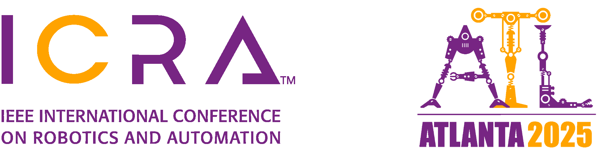
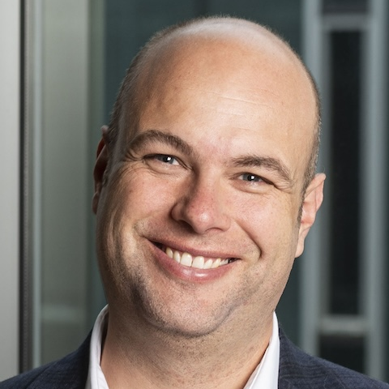
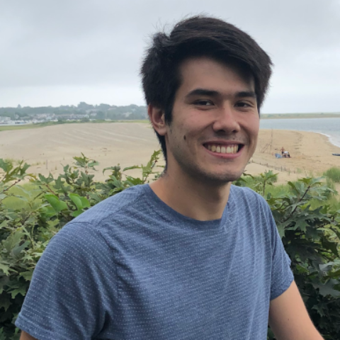
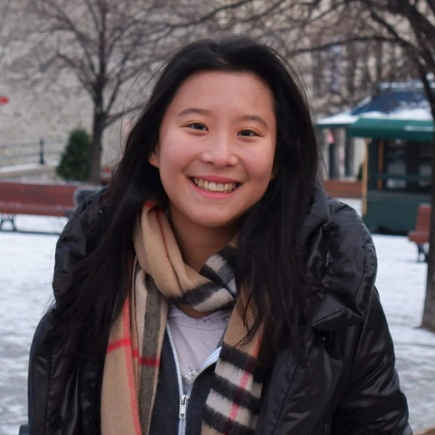
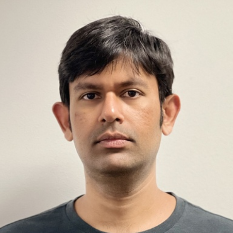
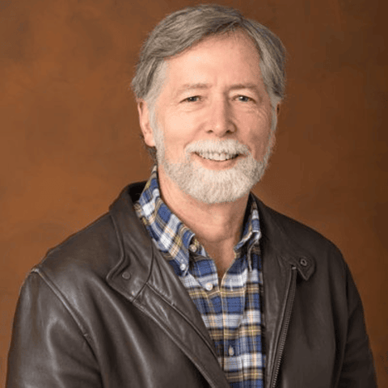
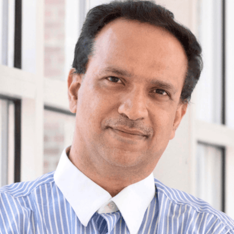
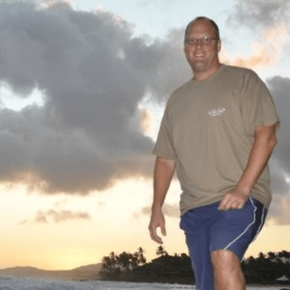

## General Information

The field of off-road autonomy has been of great interest due to applications in various industries, such as agriculture, search and rescue, and military operations. The dynamic and unpredictable nature of off-road environments poses unique challenges and opens avenues for all aspects of robotic research. The goal of this workshop is to engage experts and researchers in off-road autonomy, in a broad coverage of public datasets, benchmarks, software stacks, infrastructures, state estimation, semantic segmentation, traversability estimation, terrain analysis, planning, dynamics model, domain adaptation, and more.

This will be a full-day workshop. It will feature a mix of presentations, open panel discussions, and an invited poster session. There will be eight invited speakers and a keynote speaker to discuss their related research, thoughts, and experiences in various directions within off-road autonomy. The workshop aims to foster discussion, share insights, and encourage collaborations among experts from academia, industry, and research institutions, as well as to identify the key challenges and opportunities in the advancement of off-road autonomy technologies.

## Organizers

  

    
    <figcaption>
        <a href="https://theairlab.org/team/wenshan">Wenshan Wang</a>
    </figcaption>
  

  

    
    <figcaption>
        <a href="https://theairlab.org/team/sebastian">Sebastian Scherer</a>
    </figcaption>
  

  

    
    <figcaption>
        <a href="https://theairlab.org/team/sam_triest/">Samuel Triest</a>
    </figcaption>  
  

  

    
    <figcaption>
        <a href="https://cherieho.com/">Cherie Ho</a>
    </figcaption>
  

  

    
    <figcaption>
        <a href="https://shubhraaich.github.io/">Shubhra Aich</a>
    </figcaption>
  
    

## Speakers

  

    
    <figcaption>
        <a href="http://asrl.utias.utoronto.ca/~tdb/">Tim Barfoot</a>
    </figcaption>
  

  

    
    <figcaption>
        <a href="https://en.wikipedia.org/wiki/Peter_Griffin">Marija Popović</a>
    </figcaption>
  

  

    
    <figcaption>
        <a href="https://robotics.jpl.nasa.gov/who-we-are/people/larry_matthies/">Larry Matthies</a>
    </figcaption>
  
  
  

    
    <figcaption>
        <a href="https://www.cs.umd.edu/people/dmanocha">Dinesh Manocha</a>
    </figcaption>
  

  

    
    <figcaption>
        <a href="https://www.darpa.mil/staff/dr-stuart-young">Stuart Young</a>
    </figcaption>
  

  

    
    <figcaption>
        <a href="https://urobot.kaist.ac.kr/url_teams/prof-hyunmyung/">Hyun Myung</a>
    </figcaption>
  

  

    
    <figcaption>
        <a href="https://rsl.ethz.ch/the-lab/people/person-detail.html?persid=121911">Marco Hutter</a>
    </figcaption>
  
        

## Important Dates

- Submissions open: Feb 1st 2024
- Submission deadline: Apr 8th 2024
- Decision notification: Apr 21th 2024
- Camera-ready deadline: May 7th 2024
- Workshop: May 17th 2024

## Topics Covered

- Multi-modal perception
- Self-supervised learning
- Sim-to-real transfer
- Online adaptation
- Traversability estimation
- Foundation models for navigation
- Heterogeneous collaborative robots
- Off-road driving dataset
- Safe robot operation in uncertain and dynamic environments
- Planning without prior knowledge of an environment
- Approaches to off-road driving that work on multiple types of robots
- Long-term localization and mapping in complex environments
- Representations of terrain that model physical properties and robot-environment interaction

## Submission Instructions

Submissions should be short papers up to 4 pages in PDF format (not counting references and an optional appendix, which can go over the limit) This workshop will not provide formal official proceedings and the papers will be available on the workshop website.

## Schedule

Time     | Session
--- | ---
8:45-9:00 | Welcome
9:00-9:20 | Keynote 1: Radar Localization for Driving Off the Road (Tim Barfoot)
9:20-9:40 | Keynote 2: Learning Robust Computer Vision in Unknown Environments (Marija Popović)
9:40-10:00 | Keynote 3: Future Surface and Aerial Mobility for Mars Exploration (Larry Matthies)
10:00-10:20 | Coffee break.
10:20-10:40 | Keynote 4: Robot Navigation in Complex Indoor and Outdoor Environment (Dinesh Manocha)
10:40-11:00 | Keynote 5: Robotic Autonomy in Complex Environments with Resiliency (Stuart Young)
11:00-11:20 | Poster Oral Session A: Spotlight Talks.
11:20-12:20 | Poster Session: Attendees can walk around to view the posters.
12:20-1:20 | Lunch.
1:20-1:40 | Keynote 6: Spatial AI and ML for Autonomous Robot Navigation in Rough Terrains (Hyun Myung)
1:40-2:00 | Keynote 7: TBD (Marco Hutter)
2:00-2:20 | TBD.
2:20-2:40 | Coffee Break.
2:40-3:00 | TBD.
3:00-3:20 | Panel Discussion.
3:20-3:40 | TBD.
3:40-4:00 | Poster Oral Session B: Spotlight Talks.
4:00-4:20 | Challenge winners present their results and methodologies.
4:20-4:40 | Poster Session: Attendees can walk around to view the posters.
4:40-5:00 | Closing remarks: Workshop ends.

   
## Accepted Papers

[Openreview](https://openreview.net/group?id=IEEE.org/2024/ICRA/Workshop/Off-road_Autonomy#tab-accept-oral)

1. [TartanDrive 2.0: More Modalities and Better Infrastructure to Further Self-Supervised Learning Research in Off-Road Driving Tasks.](https://arxiv.org/abs/2402.01913), <b><a href="https://theairlab.org/TartanDrive2/">Dataset</a></b>,  <b><a href="https://github.com/castacks/tartan_drive_2.0">Code</a></b>
 