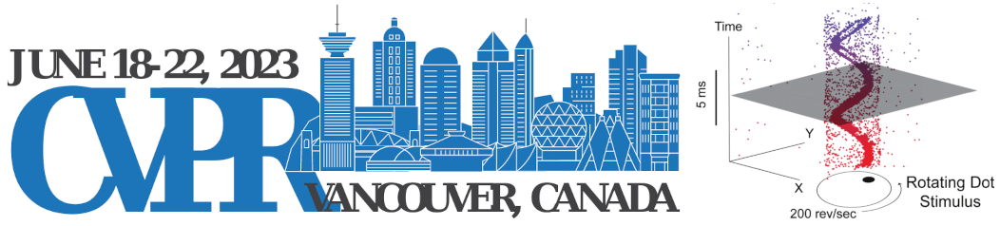

<!-- 
-->

## Organizers

  

    
    <figcaption>
        <a href="https://theairlab.org/team/wenshan">Wenshan Wang</a>
    </figcaption>
  

  

    
    <figcaption>
        <a href="https://theairlab.org/team/sebastian">Sebastian Scherer</a>
    </figcaption>
  

  

    
    <figcaption>
        <a href="https://theairlab.org/team/sam_triest/">Samuel Triest</a>
    </figcaption>  
  

  

    
    <figcaption>
        <a href="https://cherieho.com/">Cherie Ho</a>
    </figcaption>
  

  

    
    <figcaption>
        <a href="https://shubhraaich.github.io/">Shubhra Aich</a>
    </figcaption>
  
    

## Speakers

  

    
    <figcaption>
        <a href="https://www.donaldjtrump.com/">Donald John Trump</a>
    </figcaption>
  

  

    
    <figcaption>
        <a href="https://en.wikipedia.org/wiki/Peter_Griffin">Justin Peter Griffin</a>
    </figcaption>
  

